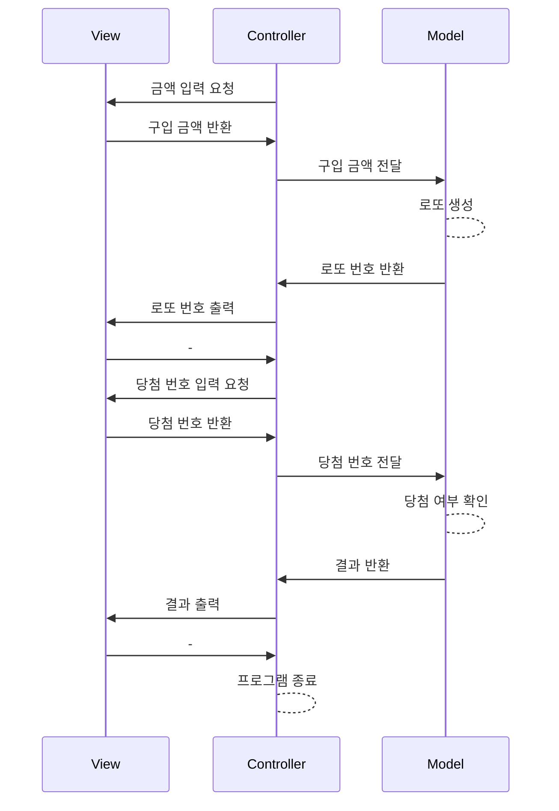

# java-lotto-precourse

> 로또 맞게 해주세요...ㅠ

<details>
	<summary>과제 세부 내용</summary>

## 과제 내용
로또 게임 기능을 구현해야 한다. 로또 게임은 아래와 같은 규칙으로 진행된다.
```
- 로또 번호의 숫자 범위는 1~45까지이다.
- 1개의 로또를 발행할 때 중복되지 않는 6개의 숫자를 뽑는다.
- 당첨 번호 추첨 시 중복되지 않는 숫자 6개와 보너스 번호 1개를 뽑는다.
- 당첨은 1등부터 5등까지 있다. 당첨 기준과 금액은 아래와 같다.
    - 1등: 6개 번호 일치 / 2,000,000,000원
    - 2등: 5개 번호 + 보너스 번호 일치 / 30,000,000원
    - 3등: 5개 번호 일치 / 1,500,000원
    - 4등: 4개 번호 일치 / 50,000원
    - 5등: 3개 번호 일치 / 5,000원
```
- 로또 구입 금액을 입력하면 구입 금액에 해당하는 만큼 로또를 발행해야 한다.
- 로또 1장의 가격은 1,000원이다.
- 당첨 번호와 보너스 번호를 입력받는다.
- 사용자가 구매한 로또 번호와 당첨 번호를 비교하여 당첨 내역 및 수익률을 출력하고 로또 게임을 종료한다.
- 사용자가 잘못된 값을 입력할 경우 `IllegalArgumentException`를 발생시키고, "[ERROR]"로 시작하는 에러 메시지를 출력 후 그 부분부터 입력을 다시 받는다.
    - `Exception`이 아닌 `IllegalArgumentException`, `IllegalStateException` 등과 같은 명확한 유형을 처리한다.

### 입출력
- 입력
    - 로또 구입 금액
    - 당첨 번호 6개
    - 보너스 번호
- 출력
    - 발행한 로또 수량 및 번호
    - 당첨 내역
    - 수익률
    - (예외 문구)

ex)

```
구입금액을 입력해 주세요.
8000

8개를 구매했습니다.
[8, 21, 23, 41, 42, 43]
[3, 5, 11, 16, 32, 38]
[7, 11, 16, 35, 36, 44]
[1, 8, 11, 31, 41, 42]
[13, 14, 16, 38, 42, 45]
[7, 11, 30, 40, 42, 43]
[2, 13, 22, 32, 38, 45]
[1, 3, 5, 14, 22, 45]

당첨 번호를 입력해 주세요.
1,2,3,4,5,6

보너스 번호를 입력해 주세요.
7

당첨 통계
---
3개 일치 (5,000원) - 1개
4개 일치 (50,000원) - 0개
5개 일치 (1,500,000원) - 0개
5개 일치, 보너스 볼 일치 (30,000,000원) - 0개
6개 일치 (2,000,000,000원) - 0개
총 수익률은 62.5%입니다.
```

</details>

## 코드 흐름
- 로또 구매 금액을 입력받는다.
- 로또를 번호를 생성하고 출력한다.
- 당첨 번호를 입력받는다.
- 결과를 계산한 후 출력한다.



## 구현 기능 목록
- 입출력
    - [ ] 구입 금액 입력
    - [ ] 당첨 번호 입력
    - [ ] 보너스 번호 입력
    - [ ] 발행한 로또 수량 및 번호
    - [ ] 당첨 내역
    - [ ] 수익률
    - [ ] 예외
- 로또
    - [ ] 로또 생성
    - [ ] 당첨 확인
    - [ ] 수익률 계산

## 처리할 예외
- 나누어 떨어지지 않는 금액 (1000 단위로 떨어지지 않을 때)
    - `[ERROR] 1,000원 단위로 입력해 주세요.`
- 너무 큰 구입 금액
    - `[ERROR] $입력한 금액 보다 작은 금액을 입력해 주세요.`
- 부적절한 구입 금액 (음수 입력 등 포함, 입력 예외)
    - `[ERROR] 유효한 구입 금액을 입력해 주세요`
- 부적절한 로또의 범위 (1-45 밖의 숫자)
    - `[ERROR] 1부터 45 사이의 값을 입력해 주세요.`
- 중복되는 번호 / 보너스 번호
    - `[ERROR] 중복되지 않은 번호를 입력해주세요.`
- 부적절한 양식 혹은 갯수
    - `[ERROR] 당첨 번호 6개를 정확히 입력해주세요. ex)1,2,3,4,5,6`
    - `[ERROR] 보너스 번호 하나를 정확히 입력해주세요. ex)7`